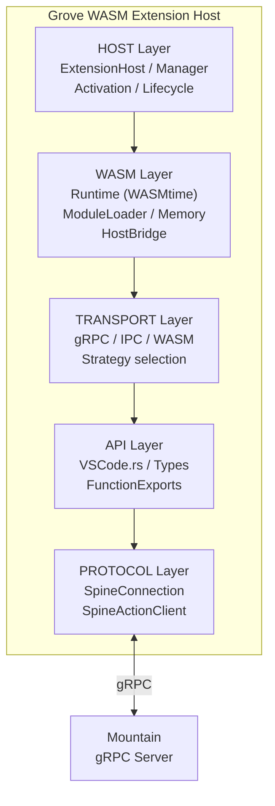

<table>
	<tr>
		<td colspan="1">
			<h3 align="center">
				<picture>
					<source media="(prefers-color-scheme: dark)" srcset="https://editor.land/Dark/Image/GitHub/Land.svg">
					<source media="(prefers-color-scheme: light)" srcset="https://editor.land/Image/GitHub/Land.svg">
					
				</picture>
			</h3>
		</td>
		<td colspan="3" valign="top"><h3 align="center">Grove&#x2001;🌿</h3></td>
	</tr>
</table>

---

# **Grove**&#x2001;🌿&#x2001;Architecture

`Grove` is the native `Rust`/`WASM` extension host for `Land`. It provides a
sandboxed environment for running `WASM`-compiled `VS Code` extensions via
`WASMtime`, sharing the same `VS Code` API surface as `Cocoon`.

---

## Table of Contents

1. [Overview](#overview)
2. [Architecture](#architecture)
3. [Transport Strategies](#transport-strategies)
4. [WASM Runtime](#wasm-runtime)
5. [VS Code API Surface](#vs-code-api-surface)
6. [Extension Lifecycle](#extension-lifecycle)
7. [Feature Gates](#feature-gates)
8. [Related Documentation](#related-documentation)

---



## Overview&#x2001;📋

`Grove` is a `Rust` binary and library with these characteristics:

- Provides an alternative extension host for `WASM`-compiled `VS Code`
  extensions
- Uses `WASMtime` for sandboxed execution
- Supports multiple transport strategies for communication with `Mountain`

| Attribute     | Value                                                                    |
| ------------- | ------------------------------------------------------------------------ |
| Language      | `Rust` (edition 2021)                                                    |
| Crate type    | Library + Binary                                                         |
| WASM runtime  | `WASMtime` (optional feature)                                            |
| Dependencies  | `Common`, `wasmtime`, `wasmtime-wasi`, `tonic`, `prost`, `clap`, `serde` |
| Feature-gated | Not enabled by default (opt-in: `--features grove`)                      |

---

## Architecture&#x2001;🏗️

`Grove` is organized into five layers:

```
+----------------------------------------------------------------+
|                      Grove                                      |
|                                                                |
|  +------------------------+  +------------------------------+  |
|  |    Host Layer          |  |    WASM Layer                |  |
|  |  - ExtensionHost.rs    |  |  - Runtime.rs (WASMtime)    |  |
|  |  - ExtensionManager.rs |  |  - ModuleLoader.rs           |  |
|  |  - Activation.rs       |  |  - MemoryManager.rs          |  |
|  |  - Lifecycle.rs        |  |  - HostBridge.rs             |  |
|  |  - APIBridge.rs        |  +------------------------------+  |
|  +------------------------+                                     |
|                                                                |
|  +------------------------+  +------------------------------+  |
|  |    Transport Layer     |  |    API Layer                 |  |
|  |  - gRPCTransport.rs    |  |  - VSCode.rs                 |  |
|  |  - IPCTransport.rs     |  |  - Types.rs                  |  |
|  |  - WASMTransport.rs    |  |  - FunctionExports.rs        |  |
|  |  - Strategy.rs         |  +------------------------------+  |
|  +------------------------+                                     |
|                                                                |
|  +------------------------+                                     |
|  |    Protocol Layer      |                                     |
|  |  - SpineConnection.rs  |                                     |
|  |  - SpineActionClient   |                                     |
|  +------------------------+                                     |
+----------------------------------------------------------------+
```

### Module Map&#x2001;🗺️

| Path                                    | Purpose                                |
| --------------------------------------- | -------------------------------------- |
| `Source/Host/ExtensionHost.rs`          | Main extension host controller         |
| `Source/Host/ExtensionManager.rs`       | Extension discovery and loading        |
| `Source/Host/Activation.rs`             | Extension activation logic             |
| `Source/Host/Lifecycle.rs`              | Extension startup/shutdown lifecycle   |
| `Source/Host/APIBridge.rs`              | Bridges WASM API calls to Mountain     |
| `Source/WASM/Runtime.rs`                | WASMtime engine initialization         |
| `Source/WASM/ModuleLoader.rs`           | WASM module loading and compilation    |
| `Source/WASM/MemoryManager.rs`          | WASM linear memory management          |
| `Source/WASM/HostBridge.rs`             | Host function registration for WASM    |
| `Source/WASM/FunctionExport.rs`         | Exported WASM function wrappers        |
| `Source/Transport/gRPCTransport.rs`     | gRPC-based communication with Mountain |
| `Source/Transport/IPCTransport.rs`      | IPC-based communication                |
| `Source/Transport/WASMTransport.rs`     | Direct WASM host function calls        |
| `Source/Transport/Strategy.rs`          | Transport selection strategy trait     |
| `Source/Transport/CommonAdapter.rs`     | Shared transport utilities             |
| `Source/Protocol/SpcineConnection.rs`   | Spine protocol client connection       |
| `Source/Protocol/SpcineActionClient.rs` | Spine action/response client           |
| `Source/Binary/Main.rs`                 | Binary entry point                     |

---

## Transport Strategies&#x2001;🔗

`Grove` supports three transport strategies for communicating with `Mountain`:

| Strategy | Tracking          | Latency | Use Case                        |
| -------- | ----------------- | ------- | ------------------------------- |
| **gRPC** | `--features grpc` | ~1ms    | Remote extension host (default) |
| **IPC**  | `--features ipc`  | ~0.1ms  | Same-machine communication      |
| **WASM** | `--features wasm` | ~0.01ms | In-process WASM host functions  |

### Transport Selection&#x2001;🎯

```rust
pub enum TransportStrategy {
    /// gRPC over TCP (default)
    Grpc(GrpcConfig),
    /// Unix domain socket or named pipe
    Ipc(IpcConfig),
    /// Direct WASM host function calls
    Wasm(WasmConfig),
}
```

- The transport strategy is selected at build time via `Cargo` features
- `--features all` enables all three

---

## WASM Runtime&#x2001;⚡

`Grove` uses `WASMtime` as its `WebAssembly` runtime:

| Component      | Detail                                          |
| -------------- | ----------------------------------------------- |
| Engine         | WASMtime with Cranelift compiler                |
| WASI           | wasmtime-wasi for sandboxed I/O                 |
| Memory         | Configurable initial/maximum memory pages       |
| Host functions | Registered via HostBridge for VS Code API calls |
| Module cache   | Compiled module caching for faster startup      |

### Sandbox Properties&#x2001;🔒

| Property    | Setting                                    |
| ----------- | ------------------------------------------ |
| File system | WASI virtual filesystem (no host access)   |
| Network     | Proxied through Mountain via gRPC          |
| Process     | No process creation (wasmtime restriction) |
| Memory      | Isolated linear memory per module          |
| CPU         | Bounded by WASMtime execution limits       |

### Host Function Bridge&#x2001;🌉

The `HostBridge` registers `VS Code` API functions as `WASM` imports:

```rust
// HostBridge registers host functions that WASM modules can call
let mut linker = Linker::new(&engine);
linker.func_wrap("vscode", "readFile", |path_ptr: i32, path_len: i32| {
    // Read file through Mountain via gRPC
    let host = HostBridge::current();
    host.read_file(path_ptr, path_len)
})?;
```

---

## VS Code API Surface&#x2001;📦

`Grove` implements a subset of the `VS Code` API for `WASM` extensions:

| Namespace          | Support Level | Notes                                             |
| ------------------ | ------------- | ------------------------------------------------- |
| `vscode.commands`  | Full          | registerCommand, executeCommand                   |
| `vscode.window`    | Partial       | showInformationMessage, showInputBox              |
| `vscode.workspace` | Partial       | workspace folders, configuration                  |
| `vscode.languages` | Partial       | registerHoverProvider, registerCompletionProvider |
| `vscode.env`       | Full          | appName, appRoot, language                        |

---

## Extension Lifecycle&#x2001;🔄

```
1. ExtensionManager discovers WASM extension (.wasm file + package.json)
    |
    v
2. ModuleLoader compiles WASM module with WASMtime
    |  - Validates module structure
    |  - Creates WASM instance with HostBridge
    |
    v
3. Activation.rs calls extension's activate() export
    |  - Passes VS Code API surface via imports
    |  - Extension registers providers and commands
    |
    v
4. Normal operation:
    |  - Extension API calls routed through HostBridge
    |  - HostBridge dispatches to Mountain via transport layer
    |  - Results returned to WASM extension
    |
    v
5. Lifecycle.rs handles deactivation
    |  - Calls extension's deactivate() export
    |  - Unregisters all providers and commands
    |  - Frees WASM module memory
```

---

## Feature Gates&#x2001;🚩

`Grove`'s `Cargo` features control build configuration:

| Feature | Default | Description                                   |
| ------- | ------- | --------------------------------------------- |
| `grpc`  | Yes     | Enable gRPC transport (requires tonic, prost) |
| `wasm`  | Yes     | Enable WASM runtime (requires wasmtime)       |
| `ipc`   | No      | Enable IPC transport                          |
| `all`   | No      | Enable all transport strategies               |

- When not enabled, `Grove` is a compile-time no-op
- `Mountain` links it conditionally:

```toml
# Mountain/Cargo.toml
[features]
grove = ["dep:grove"]
```

---

## Related Documentation&#x2001;📚

- [Common](https://github.com/CodeEditorLand/Common/tree/Current/Documentation/GitHub/Architecture.md) -
  Shared traits and `ActionEffect` system
- [Mountain](https://github.com/CodeEditorLand/Mountain/tree/Current/Documentation/GitHub/Architecture.md) -
  Main backend (`Grove` integration)
- [Cocoon](https://github.com/CodeEditorLand/Cocoon/tree/Current/Documentation/GitHub/Architecture.md) -
  Primary extension host (`Node.js`)
- [InterComponentProtocol](https://github.com/CodeEditorLand/Land/tree/Current/Documentation/GitHub/InterComponentProtocol.md) -
  `gRPC` protocol specification
- [RustInfrastructure](https://github.com/CodeEditorLand/Land/tree/Current/Documentation/GitHub/RustInfrastructure.md) -
  `Rust` backend components

---

## Shim Compatibility

| 🟠 Low-Level Shim                              | 🔵 Coverage Shim                   |
| ---------------------------------------------- | ---------------------------------- |
| Tier: `TierShim=Own\|Preempt`                  | Tier: `TierShim=Proxy\|Replace`    |
| Engine prototype hooks                         | Service routing + audit            |
| Error, Emitter, Cancel, Dispose, Async, Timing | IPC SwallowMap, DI proxy, AuditLog |

> This Element supports the Land deep-shim interception system. The shim
> intercepts VS Code engine events at both the JavaScript prototype level (🟠
> orange) and the application service level (🔵 blue). Gated behind `TierShim`
> env var (default: `None` - zero overhead). See the
> [Shim documentation](/doc/low-level-shim).

**Shim Modules:** No shim-specific modules - events routed through
`Wind`/`Mountain`/`Cocoon`.

---

**Project Maintainers:** Source Open
([Source/Open@Editor.Land](mailto:Source/Open@Editor.Land)) |
[GitHub Repository](https://github.com/CodeEditorLand/Grove) |
[Report an Issue](https://github.com/CodeEditorLand/Grove/issues)
