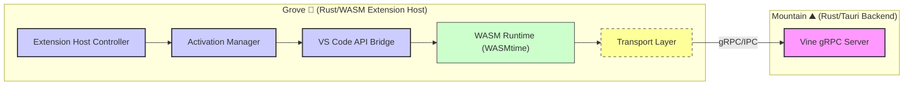

<table>
<tr>
<td align="left" valign="middle">
<h3 align="left"> Grove</h3>
</td>
<td align="left" valign="middle">
<h3 align="left">
🌳
</h3>
</td>
<td align="left" valign="middle">
<h3 align="left"> + </h3>
</td>
<td align="left" valign="middle">
<h3 align="left">
<a href="https://Editor.Land" target="_blank">
<picture>
<source media="(prefers-color-scheme: dark)" srcset="https://PlayForm.Cloud/Dark/Image/GitHub/Land.svg">
<source media="(prefers-color-scheme: light)" srcset="https://PlayForm.Cloud/Image/GitHub/Land.svg">

</picture>
</a>
</h3>
</td>
<td align="left" valign="middle">
<h3 align="left">
<a href="https://Editor.Land" target="_blank">
Land
</a>
</h3>
</td>
<td align="left" valign="middle">
<h3 align="left">
🏞️
</h3>
</td>
</tr>
</table>

---

# **Grove**&#x2001;🌳

> **VS Code extensions run with full Node.js capabilities in a shared process. A malicious or buggy extension can access any file, make any network request, and read another extension's state. The extension sandbox is a policy document, not a technical boundary.**

_"An extension can only touch what you explicitly grant. The sandbox is enforced by the hardware, not a policy."_

&#x2001;
&#x2001;
&#x2001;

Grove runs extensions compiled to WebAssembly inside WASMtime with capability-based security. An extension can only touch resources explicitly granted to it: a specific directory, a network endpoint, a named IPC channel. No implicit ambient authority. The WASM sandbox is a technical boundary enforced by the runtime.

📖 **[Rust API Documentation](https://Rust.Documentation.Editor.Land/grove/)**

---

## What It Does&#x2001;🔐

- **Capability-based isolation.** Extensions can only access resources explicitly granted to them.
- **WASM sandbox.** WASMtime enforces the boundary at the runtime level, not by policy.
- **Zero trust marketplace.** The path to running untrusted extensions safely, like mobile apps on iOS.
- **Rhai scripting.** Lightweight automation tasks run in Grove without a full extension.

---

## In the Ecosystem&#x2001;🌳 + 🏞️

---

## Development&#x2001;🛠️

Grove is a component of the Land workspace. Follow the
[Land Repository](https://github.com/CodeEditorLand/Land) instructions to
build and run.

---

## License&#x2001;⚖️

CC0 1.0 Universal. Public domain. No restrictions.
[LICENSE](https://github.com/CodeEditorLand/Grove/tree/Current/LICENSE)

---

## See Also

- [Grove Documentation](https://editor.land/Doc/grove)
- [Architecture Overview](https://editor.land/Doc/architecture)
- [Why WebAssembly](https://editor.land/Doc/why-webassembly)
- [Mountain](https://github.com/CodeEditorLand/Mountain)
- [Cocoon](https://github.com/CodeEditorLand/Cocoon)

## Funding & Acknowledgements 🙏🏻

**Grove** is a core element of the **Land** ecosystem. This project is funded
through [NGI0 Commons Fund](https://NLnet.NL/commonsfund), a fund established by
[NLnet](https://NLnet.NL) with financial support from the European Commission's
[Next Generation Internet](https://ngi.eu) program. Learn more at the
[NLnet project page](https://NLnet.NL/project/Land).

The project is operated by PlayForm, based in Sofia, Bulgaria.

PlayForm acts as the open-source steward for Code Editor Land under the NGI0
Commons Fund grant.

<table>
	<thead>
		<tr>
			<th align="left"><strong>Land</strong></th>
			<th align="left"><strong>PlayForm</strong></th>
			<th align="left"><strong>NLnet</strong></th>
			<th align="left"><strong>NGI0 Commons Fund</strong></th>
		</tr>
	</thead>
	<tbody>
		<tr>
			<td align="left" valign="middle">
				
			</td>
			<td align="left" valign="middle">
				
			</td>
			<td align="left" valign="middle">
				
			</td>
			<td align="left" valign="middle">
				
			</td>
		</tr>
	</tbody>
</table>

---

**Project Maintainers**: Source Open
([Source/Open@Editor.Land](mailto:Source/Open@Editor.Land)) |
[GitHub Repository](https://github.com/CodeEditorLand/Grove) |
[Report an Issue](https://github.com/CodeEditorLand/Grove/issues) |
[Security Policy](https://github.com/CodeEditorLand/Grove/security/policy)
