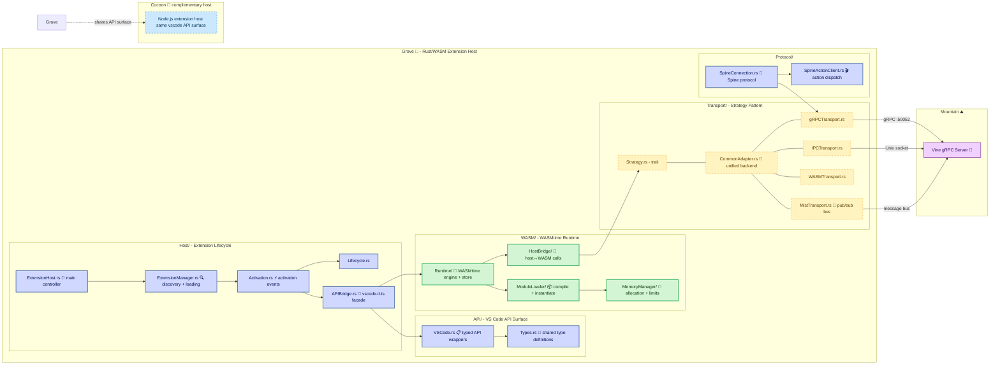

# **Grove**&#x2001;🌳

<table>
	<tr>
		<td>
			<a href="https://GitHub.Com/CodeEditorLand/Grove" target="_blank">
				<picture>
					<source media="(prefers-color-scheme: dark)" srcset="https://img.shields.io/github/last-commit/CodeEditorLand/Grove?label=Last-commit&color=black&labelColor=black&logoColor=white&logoWidth=0" />
					<source media="(prefers-color-scheme: light)" srcset="https://img.shields.io/github/last-commit/CodeEditorLand/Grove?label=Last-commit&color=white&labelColor=white&logoColor=black&logoWidth=0" />
					
				</picture>
			</a>
			<br />
			<a href="https://GitHub.Com/CodeEditorLand/Grove" target="_blank">
				<picture>
					<source media="(prefers-color-scheme: dark)" srcset="https://img.shields.io/github/issues/CodeEditorLand/Grove?label=Issues&color=black&labelColor=black&logoColor=white&logoWidth=0" />
					<source media="(prefers-color-scheme: light)" srcset="https://img.shields.io/github/issues/CodeEditorLand/Grove?label=Issues&color=white&labelColor=white&logoColor=black&logoWidth=0" />
					
				</picture>
			</a>
		</td>
		<td>
			<a href="https://github.com/CodeEditorLand/Grove" target="_blank">
				<picture>
					<source media="(prefers-color-scheme: dark)" srcset="https://img.shields.io/github/stars/CodeEditorLand/Grove?style=flat&label=Star&logo=github&color=black&labelColor=black&logoColor=white&logoWidth=0" />
					<source media="(prefers-color-scheme: light)" srcset="https://img.shields.io/github/stars/CodeEditorLand/Grove?style=flat&label=Star&logo=github&color=white&labelColor=white&logoColor=black&logoWidth=0" />
					
				</picture>
			</a>
			<br />
			<a href="https://GitHub.Com/CodeEditorLand/Grove" target="_blank">
				<picture>
					<source media="(prefers-color-scheme: dark)" srcset="https://img.shields.io/github/downloads/CodeEditorLand/Grove?label=Downloads&color=black&labelColor=black&logoColor=white&logoWidth=0" />
					<source media="(prefers-color-scheme: light)" srcset="https://img.shields.io/github/downloads/CodeEditorLand/Grove?label=Downloads&color=white&labelColor=white&logoColor=black&logoWidth=0" />
					
				</picture>
			</a>
		</td>
	</tr>
</table>

The Native `Rust`/`WebAssembly` Extension Host for Land&#x2001;🏞️

> **VS Code extensions run with full `Node.js` capabilities in a shared process.
> A malicious or buggy extension can access any file, make any network request,
> and read another extension's state. The extension sandbox is a policy
> document, not a technical boundary.**

_"An extension can only touch what you explicitly grant. The sandbox is enforced
by the hardware, not a policy."_

[](https://github.com/CodeEditorLand/Grove/blob/Current/LICENSE)
[](https://www.rust-lang.org/)&#x2001;[](https://crates.io/crates/Grove)
[](https://www.rust-lang.org/)&#x2001;[](https://www.rust-lang.org/)
[](https://webassembly.org/)&#x2001;[](https://wasmtime.dev/)

**[Rust API Documentation](https://rust.documentation.grove.editor.land/)**&#x2001;📖

---

## Overview

**Grove** is the high-performance `Rust`/`WebAssembly` extension host for the
**Land** Code Editor. It complements `Cocoon` (`Node.js`) by providing a native
environment for running `Rust` and `WASM`-compiled VS Code extensions. Grove
offers secure sandboxing through `WASMtime`, multiple transport strategies
(`gRPC`, `IPC`, `WASM`), and full compatibility with the VS Code API surface.

VS Code extensions run with full `Node.js` capabilities in a shared process - a
malicious or buggy extension can access any file, make any network request, and
read another extension's state. Grove solves this by enforcing sandboxing at the
hardware level: an extension can only touch what you explicitly grant.

**Grove is engineered to:**

1. **Provide Native Extension Hosting** - Execute `Rust` extensions with zero
   overhead through static linking or `WASM` sandboxing.
2. **Enable Secure Sandboxing** - Isolate untrusted extensions using
   `WASMtime`'s capability-based security model with configurable memory limits
   and resource controls.
3. **Support Multiple Transports** - Communicate with `Mountain` via `gRPC`,
   `IPC`, or direct `WASM` host function calls for flexible deployment.
4. **Maintain Cocoon Compatibility** - Share the same VS Code API surface and
   activation semantics for seamless extension porting between the `Node.js` and
   native hosting environments.

---

## Key Features&#x2001;🔐

**`WASM` Runtime Integration** - Full `WebAssembly` support through `WASMtime`,
with capability-based security, configurable memory limits, CPU throttling, and
explicit host-function grants. Extensions are sandboxed at the hardware level.

**Multiple Transport Strategies** - A strategy-pattern transport layer
supporting `gRPC` (to `Mountain`'s `Vine` server on port 50052), `IPC` (Unix
socket for local communication), `WASM` (direct host function calls), and `Mist`
(message-bus integration with the `Mist` pub/sub system).

**Standalone Operation** - Can run as an independent process with its own
lifecycle, or connect to `Mountain` via `gRPC` for distributed deployment. The
`Transport/CommonAdapter` unifies all transport backends behind a single
interface.

**Cross-Platform** - Native support for `macOS`, `Linux`, and `Windows` with
platform-specific optimizations. The `Binary/Main/` entry point handles platform
signal handling and daemon initialization.

**`VS Code` API Compatibility** - Implements `vscode.d.ts` type definitions
through the `APIBridge` facade, with `API/VSCode.rs` providing typed wrappers
for the full VS Code extension API surface including commands, windows, and
notifications.

**Secure by Default** - `#![deny(unsafe_code)]` at the crate level, `WASMtime`
capability-based isolation, configurable memory limits per extension, and
explicit host-function grants ensure no extension can escape its sandbox.

---

## Core Architecture Principles&#x2001;🏗️

| Principle                 | Description                                                                                                                                    | Key Components                                                                                                                                             |
| ------------------------- | ---------------------------------------------------------------------------------------------------------------------------------------------- | ---------------------------------------------------------------------------------------------------------------------------------------------------------- |
| **Security First**        | Isolate extensions via `WASMtime`'s capability model with configurable resource limits. Unsafe code is denied at the crate level.              | `WASM/Runtime`, `WASM/MemoryManager`, `WASM/HostBridge`                                                                                                    |
| **Transport Agnosticism** | Multiple communication strategies behind a unified `Transport/Strategy` trait so deployment choice is a config flag, not a code change.        | `Transport/Strategy`, `Transport/CommonAdapter`, `Transport/gRPCTransport`, `Transport/IPCTransport`, `Transport/WASMTransport`, `Transport/MistTransport` |
| **API Surface Parity**    | Implement the full VS Code extension API (`vscode.d.ts`) so extensions port seamlessly between `Cocoon` and `Grove`.                           | `API/VSCode`, `API/Types`, `Host/APIBridge`, `Host/Activation`                                                                                             |
| **Composability**         | Modular separation of host core, `WASM` runtime, transport layer, and protocol handling. Each module can be compiled and tested independently. | `Host/*`, `WASM/*`, `Transport/*`, `Protocol/*`, `API/*`                                                                                                   |

---

## System Architecture&#x2001;



**Connection paths:**

| Path                        | Protocol                           | Use Case                                                 |
| --------------------------- | ---------------------------------- | -------------------------------------------------------- |
| Grove → Mountain via `gRPC` | Protobuf over `gRPC` on port 50052 | Distributed deployment, remote extensions                |
| Grove → Mountain via `IPC`  | Unix domain socket                 | Local single-machine communication                       |
| Grove → Mountain via `Mist` | Message-bus pub/sub                | Event-driven, decoupled workflows                        |
| Grove → Cocoon              | Shared API surface                 | Extension portability between native and `Node.js` hosts |
| Extension → `WASMtime`      | `WASM` host functions              | Sandboxed extension execution                            |
| `APIBridge` → `API/VSCode`  | Direct call                        | Typed VS Code API wrappers                               |

---

## Key Components

| Component             | Path                                      | Description                                                   |
| --------------------- | ----------------------------------------- | ------------------------------------------------------------- |
| ExtensionHost         | `Source/Host/ExtensionHost.rs`            | Main controller managing the full extension lifecycle         |
| ExtensionManager      | `Source/Host/ExtensionManager.rs`         | Extension discovery, validation, and loading                  |
| Activation            | `Source/Host/Activation.rs`               | Activation events and contribution point handling             |
| Lifecycle             | `Source/Host/Lifecycle.rs`                | Extension state machine (install, enable, disable, uninstall) |
| APIBridge             | `Source/Host/APIBridge.rs`                | VS Code API facade implementing `vscode.d.ts`                 |
| VSCode API            | `Source/API/VSCode.rs`                    | Typed wrappers for the full VS Code extension API surface     |
| API Types             | `Source/API/Types.rs`                     | Shared type definitions for extension API interactions        |
| WASM Runtime          | `Source/WASM/Runtime.rs`                  | `WASMtime` engine and store lifecycle                         |
| ModuleLoader          | `Source/WASM/ModuleLoader.rs`             | `WASM` module compilation and instantiation                   |
| MemoryManager         | `Source/WASM/MemoryManager.rs`            | Configurable memory limits and allocation tracking            |
| HostBridge            | `Source/WASM/HostBridge.rs`               | Host-to-`WASM` function call dispatch                         |
| FunctionExport        | `Source/WASM/FunctionExport.rs`           | Export host functions to `WASM` guest modules                 |
| Transport Strategy    | `Source/Transport/Strategy.rs`            | Transport strategy trait definition                           |
| CommonAdapter         | `Source/Transport/CommonAdapter.rs`       | Unified transport backend routing                             |
| gRPC Transport        | `Source/Transport/gRPCTransport.rs`       | `gRPC`-based communication with `Mountain`                    |
| IPC Transport         | `Source/Transport/IPCTransport.rs`        | Inter-process communication (Unix socket)                     |
| WASM Transport        | `Source/Transport/WASMTransport.rs`       | Direct `WASM` host-function communication                     |
| Mist Transport        | `Source/Transport/MistTransport.rs`       | Message-bus integration with `Mist` pub/sub                   |
| Spine Connection      | `Source/Protocol/SpineConnection.rs`      | `Spine` protocol client connection                            |
| Spine Action Client   | `Source/Protocol/SpineActionClient.rs`    | Action dispatch over `Spine` protocol                         |
| Configuration Service | `Source/Services/ConfigurationService.rs` | Service for managing extension-level configuration            |
| Common Traits         | `Source/Common/Traits.rs`                 | Shared trait definitions for the extension host               |
| Common Error          | `Source/Common/Error.rs`                  | Unified error types for the host layer                        |
| Runtime Build         | `Source/Binary/Build/RuntimeBuild.rs`     | Build-time runtime configuration                              |
| Service Register      | `Source/Binary/Build/ServiceRegister.rs`  | Service registration at build time                            |
| Entry                 | `Source/Binary/Main/Entry.rs`             | Platform entry point and daemon initialization                |

---

## Project Structure&#x2001;🗺️

```
Element/Grove/
├── Source/
│   ├── Library.rs                     # Library root (cdylib + rlib)
│   ├── main.rs                        # Binary entry point
│   ├── DevLog.rs                      # Development logging infrastructure
│   ├── API/                           # VS Code API surface
│   │   ├── mod.rs                     # Module re-exports
│   │   ├── VSCode.rs                  # Typed VS Code extension API wrappers
│   │   └── Types.rs                   # Shared API type definitions
│   ├── Binary/                        # Binary initialization
│   │   ├── mod.rs
│   │   ├── Build/                     # Build-time configuration
│   │   │   ├── mod.rs
│   │   │   ├── RuntimeBuild.rs        # Build-time runtime configuration
│   │   │   └── ServiceRegister.rs     # Service registration at build time
│   │   └── Main/                      # Main entry point + platform init
│   │       ├── mod.rs
│   │       └── Entry.rs               # Platform entry point and daemon init
│   ├── Common/                        # Shared traits and error types
│   │   ├── mod.rs
│   │   ├── Traits.rs                  # Core trait definitions
│   │   └── Error.rs                   # Unified error types
│   ├── Host/                          # Extension lifecycle management
│   │   ├── mod.rs
│   │   ├── ExtensionHost.rs           # Main host controller
│   │   ├── ExtensionManager.rs        # Discovery and loading
│   │   ├── Activation.rs              # Activation events
│   │   ├── Lifecycle.rs               # Lifecycle state machine
│   │   └── APIBridge.rs               # VS Code API facade
│   ├── Services/                      # Extension-level services
│   │   ├── mod.rs
│   │   └── ConfigurationService.rs    # Extension configuration management
│   ├── WASM/                          # WebAssembly runtime integration
│   │   ├── mod.rs
│   │   ├── Runtime.rs                 # WASMtime engine and store
│   │   ├── ModuleLoader.rs            # Module compilation + instantiation
│   │   ├── MemoryManager.rs           # Memory allocation and limits
│   │   ├── HostBridge.rs              # Host-to-WASM function calls
│   │   └── FunctionExport.rs          # Host function export to WASM
│   ├── Transport/                     # Communication strategies
│   │   ├── mod.rs
│   │   ├── Strategy.rs                # Transport strategy trait
│   │   ├── CommonAdapter.rs           # Unified transport backend
│   │   ├── gRPCTransport.rs           # gRPC to Mountain
│   │   ├── IPCTransport.rs            # Inter-process (Unix only)
│   │   ├── WASMTransport.rs           # Direct WASM communication
│   │   └── MistTransport.rs           # Mist message-bus integration
│   └── Protocol/                      # Protocol handling
│       ├── mod.rs
│       ├── SpineConnection.rs         # Spine protocol client
│       ├── SpineActionClient.rs       # Action dispatch
│       └── Generated/                 # Code-generated protocol types
│           └── grove.rs               # Generated gRPC service definitions
├── Documentation/
│   └── Rust/
│       └── doc/                       # Cargo doc output
├── Cargo.toml
└── LICENSE
```

---

## In the Land Project

Grove serves as the native `Rust`/`WASM` extension host alongside `Cocoon` (the
`Node.js` host). Together they provide the two execution environments for the
Land editor's extension model:

| Host       | Language                   | Runtime                   | Sandboxing                             |
| ---------- | -------------------------- | ------------------------- | -------------------------------------- |
| **Grove**  | `Rust`, `WASM`             | `WASMtime`                | Hardware-enforced via capability model |
| **Cocoon** | `TypeScript`, `JavaScript` | `Node.js` via `Effect-TS` | Fiber-level process isolation          |

Grove communicates with `Mountain` via `gRPC` (port 50052), `IPC` (Unix socket),
or the `Mist` message bus for event-driven workflows. It shares the same VS Code
API surface as `Cocoon`, enabling seamless porting of extensions between the
`Node.js` and native hosting environments.

The `Transport/CommonAdapter` abstracts all communication strategies behind a
single interface, allowing deployment flexibility - standalone process,
distributed via `gRPC`, or integrated with `Mountain`'s `Vine` server.

---

## Getting Started&#x2001;🚀

### Prerequisites

- **Rust** 1.75 or later
- Protocol Buffer compiler (optional, for proto file modifications)
- For `WASM` builds: `rustup target add wasm32-wasi`

### Build for Native

```bash
cd Element/Grove
cargo build --release
```

### Build for WASM

```bash
cd Element/Grove
cargo build --target wasm32-wasi --release
```

### Build with Features

```bash
# All features enabled
cargo build --release --features all

# WASM only
cargo build --release --features wasm

# gRPC only
cargo build --release --features grpc
```

### Available Features

| Feature   | Description                             |
| --------- | --------------------------------------- |
| `default` | Enables `grpc` and `wasm`               |
| `grpc`    | `gRPC` transport support                |
| `wasm`    | `WebAssembly` runtime support           |
| `ipc`     | Inter-process communication (Unix only) |
| `all`     | All features enabled                    |

### As a Library

```rust
use grove::{ExtensionHost, Transport};

#[tokio::main]
async fn main() -> anyhow::Result<()> {
    let Host = ExtensionHost::new(Transport::default()).await?;
    Host.load_extension("/path/to/extension").await?;
    Host.activate().await?;
    Ok(())
}
```

---

## Security&#x2001;🔒

Grove enforces security at multiple layers:

| Layer              | Mechanism                                                                          |
| ------------------ | ---------------------------------------------------------------------------------- |
| **Crate level**    | `#![deny(unsafe_code)]` - no unsafe code permitted                                 |
| **Runtime**        | `WASMtime` capability-based isolation - each extension gets an independent sandbox |
| **Memory**         | Configurable per-extension memory limits via `WASM/MemoryManager`                  |
| **Resources**      | CPU throttling and resource controls per extension                                 |
| **Host functions** | Explicit capability grants - extensions must declare required host functions       |
| **Type safety**    | Full `Rust` type system across the host-WASM boundary                              |

---

## Compatibility

Grove is designed to be compatible with:

| Target       | Integration                                                            |
| ------------ | ---------------------------------------------------------------------- |
| **Cocoon**   | Shares VS Code API surface, activation semantics, and manifest parsing |
| **VS Code**  | Implements `vscode.d.ts` type definitions                              |
| **Mountain** | Integrates via `GroveService` `gRPC` protocol using `Vine.proto`       |
| **Mist**     | Connects via `MistTransport` for event-driven pub/sub workflows        |

---

## API Reference

- **[Rust API Documentation](https://rust.documentation.grove.editor.land/)**&#x2001;📖

---

## Related Documentation

- [Architecture Overview](https://Editor.Land/Doc/architecture) - Land system
  architecture
- [Why WebAssembly](https://Editor.Land/Doc/why-wasm) - Why `WASM` for extension
  sandboxing
- [CHANGELOG](https://github.com/CodeEditorLand/Grove/blob/Current/CHANGELOG.md)
    - Version history and release notes
- [Mountain](https://github.com/CodeEditorLand/Mountain) - Native desktop shell
  and `gRPC` backend
- [Cocoon](https://github.com/CodeEditorLand/Cocoon) - `Node.js`/`Effect-TS`
  extension host
- [Mist](https://github.com/CodeEditorLand/Mist) - Pub/sub message bus for
  event-driven workflows

---

## Funding & Acknowledgements&#x2001;🙏🏻

This project is funded through
[NGI0 Commons Fund](https://NLnet.NL/commonsfund), a fund established by
[NLnet](https://NLnet.NL) with financial support from the European Commission's
Next Generation Internet program, under grant agreement No 101135429.

The project is operated by PlayForm, based in Sofia, Bulgaria. PlayForm acts as
the open-source steward for Code Editor Land under the NGI0 Commons Fund grant.

<table>
	<tbody>
		<tr>
			<td align="left" valign="middle">
				<a href="https://Editor.Land">
					
				</a>
			</td>
			<td align="left" valign="middle">
				<a href="https://PlayForm.Cloud">
					
				</a>
			</td>
			<td align="left" valign="middle">
				<a href="https://NLnet.NL">
					
				</a>
			</td>
			<td align="left" valign="middle">
				<a href="https://NLnet.NL/commonsfund">
					
				</a>
			</td>
		</tr>
	</tbody>
</table>
