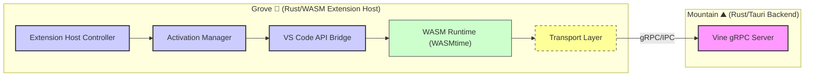

<table>
<tr>
<td align="left" valign="middle">
<h3 align="left"> Grove</h3>
</td>
<td align="left" valign="middle">
<h3 align="left">
🌳
</h3>
</td>
<td align="left" valign="middle">
<h3 align="left"> + </h3>
</td>
<td align="left" valign="middle">
<h3 align="left">
<a href="https://Editor.Land" target="_blank">
<picture>
<source media="(prefers-color-scheme: dark)" srcset="https://PlayForm.Cloud/Dark/Image/GitHub/Land.svg">
<source media="(prefers-color-scheme: light)" srcset="https://PlayForm.Cloud/Image/GitHub/Land.svg">

</picture>
</a>
</h3>
</td>
<td align="left" valign="middle">
<h3 align="left">
<a href="https://Editor.Land" target="_blank">
Land
</a>
</h3>
</td>
<td align="left" valign="middle">
<h3 align="left">
🏞️
</h3>
</td>
</tr>
</table>

---

# **Grove**&#x2001;🌳

The Native `Rust`/`WASM` Extension Host for Land&#x2001;🏞️

> **`VS Code` extensions run with full `Node.js` capabilities in a shared
> process. A malicious or buggy extension can access any file, make any network
> request, and read another extension's state. The extension sandbox is a policy
> document, not a technical boundary.**

_"An extension can only touch what you explicitly grant. The sandbox is enforced
by the hardware, not a policy."_

[](https://github.com/CodeEditorLand/Grove/tree/Current/LICENSE)
[](https://www.rust-lang.org/)&#x2001;[](https://crates.io/crates/Grove)
[](https://www.rust-lang.org/)&#x2001;[](https://www.rust-lang.org/)
[](https://webassembly.org/)&#x2001;[](https://wasmtime.dev/)

📖 **[Rust API Documentation](https://Rust.Documentation.Editor.Land/Grove/)**

Welcome to **Grove**, the high-performance `Rust`/`WebAssembly` extension host
for the **Land Code Editor**. Grove is designed to complement `Cocoon`
(`Node.js`) by providing a native environment for running `Rust` and
`WASM`-compiled `VS Code` extensions. It offers secure sandboxing through
`WASMtime`, multiple transport strategies (`gRPC`, `IPC`, `WASM`), and full
compatibility with the `VS Code` `API` surface.

**Grove** is engineered to:

1. **Provide Native Extension Hosting:** Execute `Rust` extensions with zero
   overhead through static linking or `WASM` sandboxing.
2. **Enable Secure Sandboxing:** Isolate untrusted extensions using `WASMtime`'s
   capability-based security model.
3. **Support Multiple Transports:** Communicate with `Mountain` via gRPC, IPC,
   or direct WASM host functions.
4. **Maintain Cocoon Compatibility:** Share the same VS Code API surface and
   activation semantics for seamless extension porting.

---

## Key Features&#x2001;🔐

- **`WASM` Runtime Integration:** Full `WebAssembly` support through `WASMtime`,
  enabling secure sandboxing of untrusted extensions with capability-based
  security.
- **Multiple Transport Strategies:** Support for `gRPC`, `IPC`, and direct
  `WASM` host function communication with the `Mountain` backend.
- **Standalone Operation:** Can run independently as a standalone process or
  connect to `Mountain` via `gRPC` for distributed deployment.
- **Cross-Platform Support:** Native support for `macOS`, `Linux`, and `Windows`
  with platform-specific optimizations.
- **`VS Code` API Compatibility:** Implements `vscode.d.ts` type definitions for
  seamless extension porting from the `Node.js` ecosystem.
- **Secure Sandboxing:** `WASMtime`-based isolation with configurable memory
  limits and resource controls for untrusted code.

---

## Core Architecture Principles&#x2001;🏗️

| Principle                 | Description                                                                                            | Key Components Involved                                                   |
| :------------------------ | :----------------------------------------------------------------------------------------------------- | :------------------------------------------------------------------------ |
| **Security First**        | Isolate extensions using WASMtime's capability-based security model with configurable resource limits. | `WASM/Runtime`, `WASM/MemoryManager`                                      |
| **Transport Agnosticism** | Support multiple communication strategies (gRPC, IPC, WASM) for flexible deployment scenarios.         | `Transport/Strategy`, `Transport/gRPCTransport`, `Transport/IPCTransport` |
| **API Compatibility**     | Maintain high fidelity with the VS Code API surface to enable seamless extension porting.              | `API/vscode`, `API/types`, `APIBridge`                                    |
| **Performance**           | Zero-cost abstractions via Rust with LTO optimization for maximum execution speed.                     | `Host/ExtensionHost`, `WASM/ModuleLoader`                                 |
| **Composability**         | Modular architecture with clear separation between host, transport, and API layers.                    | `Host/*`, `Transport/*`, `API/*`                                          |

---

## `Grove` in the Land Ecosystem&#x2001;🌳 + 🏞️

| Component                     | Role & Key Responsibilities                                                   |
| :---------------------------- | :---------------------------------------------------------------------------- |
| **Extension Host Controller** | Manages extension discovery, loading, and lifecycle for Rust/WASM extensions. |
| **WASM Runtime**              | Provides secure sandboxing through WASMtime with memory and resource limits.  |
| **Transport Layer**           | Handles communication with `Mountain` via gRPC, IPC, or direct WASM calls.    |
| **API Bridge**                | Implements the VS Code API facade for extension compatibility.                |
| **Activation Manager**        | Manages extension activation events and contribution points.                  |

---

## System Architecture Diagram&#x2001;🏗️

This diagram illustrates `Grove`'s internal architecture and its place within
the broader Land ecosystem.



---

## Project Structure&#x2001;🗺️

```
Element/Grove/
├── Source/
│   ├── lib.rs           # Library root
│   ├── main.rs          # Binary entry point
│   ├── Binary/          # Binary initialization
│   ├── Host/            # Extension host core
│   │   ├── ExtensionHost    # Main host controller
│   │   ├── ExtensionManager # Extension discovery and loading
│   │   ├── Activation       # Extension activation events
│   │   ├── Lifecycle        # Extension lifecycle management
│   │   └── APIBridge        # VS Code API implementation
│   ├── WASM/            # WebAssembly runtime
│   │   ├── Runtime          # WASMtime engine and store management
│   │   ├── ModuleLoader     # WASM module compilation and instantiation
│   │   ├── MemoryManager    # WASM memory allocation and management
│   │   ├── HostBridge       # Host-WASM function communication
│   │   └── FunctionExport   # Export host functions to WASM
│   ├── API/             # VS Code API facade
│   │   ├── vscode           # VS Code API facade
│   │   └── types            # Common API type definitions
│   ├── Transport/       # Communication strategies
│   │   ├── Strategy         # Transport strategy trait
│   │   ├── gRPCTransport    # gRPC-based communication with Mountain
│   │   ├── IPCTransport     # Inter-process communication
│   │   └── WASMTransport    # Direct WASM communication
│   ├── Protocol/        # Protocol handling
│   │   └── SpineConnection  # Spine protocol client connection
│   ├── Services/        # Host services
│   └── Common/          # Shared utilities
├── Proto/
│   └── Grove.proto      # Grove-specific gRPC protocol
└── Documentation/Rust/doc/
```

---

## Deep Dive & Component Breakdown&#x2001;🔬

To understand how `Grove`'s internal components interact to provide the
high-fidelity WASM and Rust extension hosting environment, see the following
source files:

- **[`Source/Host/`](https://github.com/CodeEditorLand/Grove/tree/Current/Source/Host/)** -
  Core extension host controller and lifecycle management
- **[`Source/WASM/`](https://github.com/CodeEditorLand/Grove/tree/Current/Source/WASM/)** -
  WebAssembly runtime integration with WASMtime
- **[`Source/API/`](https://github.com/CodeEditorLand/Grove/tree/Current/Source/API/)** -
  VS Code API facade and type definitions
- **[`Source/Transport/`](https://github.com/CodeEditorLand/Grove/tree/Current/Source/Transport/)** -
  Communication strategies (gRPC, IPC, WASM)
- **[`Proto/Grove.proto`](https://github.com/CodeEditorLand/Grove/tree/Current/Proto/Grove.proto)** -
  gRPC protocol definitions for Mountain integration

---

## Getting Started&#x2001;🚀

### Prerequisites

- Rust 1.75 or later
- Protocol Buffer compiler (optional, for proto file modifications)
- For WASM builds: `rustup target add wasm32-wasi`

### Build for Native

```bash
cd Element/Grove
cargo build --release
```

### Build for WASM

```bash
cd Element/Grove
cargo build --target wasm32-wasi --release
```

### Build with Features

```bash
# All features enabled
cargo build --release --features all

# WASM only
cargo build --release --features wasm

# gRPC only
cargo build --release --features grpc
```

### Available Features

- `default`: Enables `grpc` and `wasm` features
- `grpc`: gRPC transport support
- `wasm`: WebAssembly runtime support
- `ipc`: Inter-process communication (Unix only)
- `all`: All features enabled

### As Library

```rust
use grove::ExtensionHost;
use grove::Transport;

#[tokio::main]
async fn main() -> anyhow::Result<()> {
    let Host = ExtensionHost::new(Transport::default()).await?;
    Host.load_extension("/path/to/extension").await?;
    Host.activate().await?;
    Ok(())
}
```

---

## Security&#x2001;🔒

Grove provides security through:

1. **WASM Sandboxing**: Isolated execution environment via WASMtime
2. **Memory Limits**: Configurable memory constraints for extensions
3. **Resource Controls**: CPU and resource throttling
4. **Type Safety**: Rust's ownership system ensures memory safety
5. **Secure API**: Controlled access to host functions via explicit capability
   grants

---

## Compatibility&#x2001;✅

Grove is designed to be compatible with:

- **Cocoon**: Shares VS Code API surface, activation semantics, and manifest
  parsing
- **VS Code**: Implements vscode.d.ts type definitions
- **Mountain**: Integrates via GroveService gRPC protocol (Vine.proto)

---

## See Also

- [Grove Documentation](https://editor.land/Doc/grove)
- [Architecture Overview](https://editor.land/Doc/architecture)
- [Why WebAssembly](https://editor.land/Doc/why-webassembly)
- [Mountain](https://github.com/CodeEditorLand/Mountain)
- [Cocoon](https://github.com/CodeEditorLand/Cocoon)

---

## License&#x2001;⚖️

This project is released into the public domain under the **Creative Commons CC0
Universal** license. You are free to use, modify, distribute, and build upon
this work for any purpose, without any restrictions. For the full legal text,
see the
[`LICENSE`](https://github.com/CodeEditorLand/Grove/tree/Current/LICENSE) file.

---

## Changelog&#x2001;📜

Stay updated with our progress! See
[`CHANGELOG.md`](https://github.com/CodeEditorLand/Grove/tree/Current/) for a
history of changes specific to **Grove**.

---

## Funding \& Acknowledgements&#x2001;🙏🏻

**Grove** is a core element of the **Land** ecosystem. This project is funded
through [NGI0 Commons Fund](https://NLnet.NL/commonsfund), a fund established by
[NLnet](https://NLnet.NL) with financial support from the European Commission's
[Next Generation Internet](https://ngi.eu) program. Learn more at the
[NLnet project page](https://NLnet.NL/project/Land).

The project is operated by PlayForm, based in Sofia, Bulgaria.

PlayForm acts as the open-source steward for Code Editor Land under the NGI0
Commons Fund grant.

<table>
	<thead>
		<tr>
			<th align="left"><strong>Land</strong></th>
			<th align="left"><strong>PlayForm</strong></th>
			<th align="left"><strong>NLnet</strong></th>
			<th align="left"><strong>NGI0 Commons Fund</strong></th>
		</tr>
	</thead>
	<tbody>
		<tr>
			<td align="left" valign="middle">
				<a href="https://Editor.Land">
					
				</a>
			</td>
			<td align="left" valign="middle">
				<a href="https://PlayForm.Cloud">
					
				</a>
			</td>
			<td align="left" valign="middle">
				<a href="https://NLnet.NL">
					
				</a>
			</td>
			<td align="left" valign="middle">
				<a href="https://NLnet.NL/commonsfund">
					
				</a>
			</td>
		</tr>
	</tbody>
</table>

---

**Project Maintainers**: Source Open
([Source/Open@Editor.Land](mailto:Source/Open@Editor.Land)) |
[GitHub Repository](https://github.com/CodeEditorLand/Grove) |
[Report an Issue](https://github.com/CodeEditorLand/Grove/issues) |
[Security Policy](https://github.com/CodeEditorLand/Grove/security/policy)
