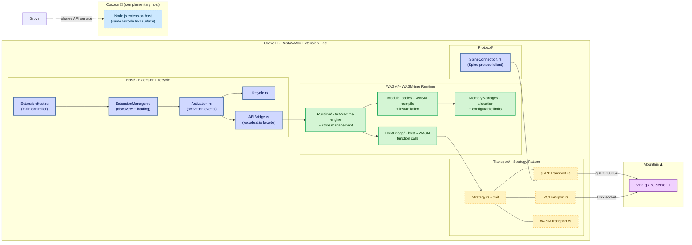

# **Grove** 🌳

The Native Rust/WASM Extension Host for Land 🏞️

[](https://github.com/CodeEditorLand/Grove/blob/Current/LICENSE)
[](https://www.rust-lang.org/) [](https://crates.io/crates/Grove)
[](https://www.rust-lang.org/) [](https://www.rust-lang.org/)
[](https://webassembly.org/) [](https://wasmtime.dev/)

**[Rust API Documentation](https://Rust.Documentation.editor.land/Grove/)**

---

## Overview

Grove is a high-performance Rust/WebAssembly extension host for the Land Code Editor. It complements Cocoon (Node.js) by providing a native environment for running Rust and WASM-compiled VS Code extensions. Grove offers secure sandboxing through WASMtime, multiple transport strategies (gRPC, IPC, WASM), and full compatibility with the VS Code API surface. VS Code extensions run with full Node.js capabilities in a shared process — a malicious or buggy extension can access any file, make any network request, and read another extension's state. Grove solves this by enforcing sandboxing at the hardware level: an extension can only touch what you explicitly grant.

**Grove is engineered to:**

1. **Provide Native Extension Hosting:** Execute Rust extensions with zero overhead through static linking or WASM sandboxing.
2. **Enable Secure Sandboxing:** Isolate untrusted extensions using WASMtime's capability-based security model.
3. **Support Multiple Transports:** Communicate with Mountain via gRPC, IPC, or direct WASM host functions.
4. **Maintain Cocoon Compatibility:** Share the same VS Code API surface and activation semantics for seamless extension porting.

## Architecture



## Key Components

| Component | Path | Description |
| --------- | ---- | ----------- |
| ExtensionHost | `Source/Host/ExtensionHost.rs` | Main extension host controller — manages extension lifecycle |
| ExtensionManager | `Source/Host/ExtensionManager.rs` | Extension discovery and loading |
| Activation | `Source/Host/Activation.rs` | Extension activation events and contribution points |
| APIBridge | `Source/Host/APIBridge.rs` | VS Code API facade (vscode.d.ts compatibility) |
| WASM Runtime | `Source/WASM/Runtime/` | WASMtime engine and store management |
| ModuleLoader | `Source/WASM/ModuleLoader/` | WASM module compilation and instantiation |
| MemoryManager | `Source/WASM/MemoryManager/` | WASM memory allocation and configurable limits |
| HostBridge | `Source/WASM/HostBridge/` | Host-to-WASM function communication |
| FunctionExport | `Source/WASM/FunctionExport/` | Export host functions to WASM |
| Transport Strategy | `Source/Transport/Strategy.rs` | Transport strategy trait |
| gRPC Transport | `Source/Transport/gRPCTransport.rs` | gRPC-based communication with Mountain |
| IPC Transport | `Source/Transport/IPCTransport.rs` | Inter-process communication (Unix only) |
| WASM Transport | `Source/Transport/WASMTransport.rs` | Direct WASM communication |
| Spine Connection | `Source/Protocol/SpineConnection.rs` | Spine protocol client connection |

## In the Land Project

Grove communicates with Mountain via gRPC (port 50052), IPC (Unix socket), or direct WASM host function calls. It shares the same VS Code API surface as Cocoon, enabling seamless porting of extensions between the Node.js and WASM/Native hosting environments. Grove's Transport layer abstracts communication strategies, allowing flexible deployment — standalone process or integrated with Mountain's Vine gRPC server.

- **Architecture Principles:** Security First (WASMtime capability-based isolation), Transport Agnosticism (gRPC, IPC, WASM), Performance (zero-cost Rust abstractions with LTO), Composability (modular Host/Transport separation).

## Getting Started

### Prerequisites

- Rust 1.75 or later
- Protocol Buffer compiler (optional, for proto file modifications)
- For WASM builds: `rustup target add wasm32-wasi`

### Build for Native

```bash
cd Element/Grove
cargo build --release
```

### Build for WASM

```bash
cd Element/Grove
cargo build --target wasm32-wasi --release
```

### Build with Features

```bash
# All features enabled
cargo build --release --features all

# WASM only
cargo build --release --features wasm

# gRPC only
cargo build --release --features grpc
```

### Available Features

- `default`: Enables `grpc` and `wasm` features
- `grpc`: gRPC transport support
- `wasm`: WebAssembly runtime support
- `ipc`: Inter-process communication (Unix only)
- `all`: All features enabled

### As Library

```rust
use grove::ExtensionHost;
use grove::Transport;

#[tokio::main]
async fn main() -> anyhow::Result<()> {
    let Host = ExtensionHost::new(Transport::default()).await?;
    Host.load_extension("/path/to/extension").await?;
    Host.activate().await?;
    Ok(())
}
```

### Security

Grove provides security through WASM sandboxing (isolated execution via WASMtime), memory limits (configurable constraints for extensions), resource controls (CPU and resource throttling), type safety (Rust's ownership system), and secure API (controlled access to host functions via explicit capability grants).

### Compatibility

Grove is designed to be compatible with Cocoon (shares VS Code API surface, activation semantics, and manifest parsing), VS Code (implements vscode.d.ts type definitions), and Mountain (integrates via GroveService gRPC protocol using Vine.proto).

### Project Structure

```
Element/Grove/
├── Source/
│   ├── lib.rs           # Library root
│   ├── main.rs          # Binary entry point
│   ├── Binary/          # Binary initialization
│   ├── Host/            # Extension host core
│   │   ├── ExtensionHost    # Main host controller
│   │   ├── ExtensionManager # Extension discovery and loading
│   │   ├── Activation       # Extension activation events
│   │   ├── Lifecycle        # Extension lifecycle management
│   │   └── APIBridge        # VS Code API implementation
│   ├── WASM/            # WebAssembly runtime
│   │   ├── Runtime          # WASMtime engine and store management
│   │   ├── ModuleLoader     # WASM module compilation and instantiation
│   │   ├── MemoryManager    # WASM memory allocation and management
│   │   ├── HostBridge       # Host-WASM function communication
│   │   └── FunctionExport   # Export host functions to WASM
│   ├── Transport/       # Communication strategies
│   │   ├── Strategy         # Transport strategy trait
│   │   ├── gRPCTransport    # gRPC-based communication with Mountain
│   │   ├── IPCTransport     # Inter-process communication
│   │   └── WASMTransport    # Direct WASM communication
│   ├── Protocol/        # Protocol handling
│   │   └── SpineConnection  # Spine protocol client connection
└── Documentation/Rust/doc/
```

## API Reference

- [Rust API Documentation](https://Rust.Documentation.editor.land/Grove/)

## Related Documentation

- [Architecture Overview](https://Editor.Land/Doc/architecture)
- [Why WebAssembly](https://Editor.Land/Doc/why-webassembly)
- [Mountain](https://github.com/CodeEditorLand/Mountain) — Native desktop shell
- [Cocoon](https://github.com/CodeEditorLand/Cocoon) — Node.js extension host

---

## Funding

This project is funded through [NGI0 Commons Fund](https://NLnet.NL/commonsfund), a fund established by [NLnet](https://NLnet.NL) with financial support from the European Commission's Next Generation Internet program, under grant agreement No 101135429.

The project is operated by PlayForm, based in Sofia, Bulgaria. PlayForm acts as the open-source steward for Code Editor Land under the NGI0 Commons Fund grant.

| | |
| --- | --- |
| [](https://Editor.Land) | [](https://PlayForm.Cloud) |
| [](https://NLnet.NL) | [](https://NLnet.NL/commonsfund) |
